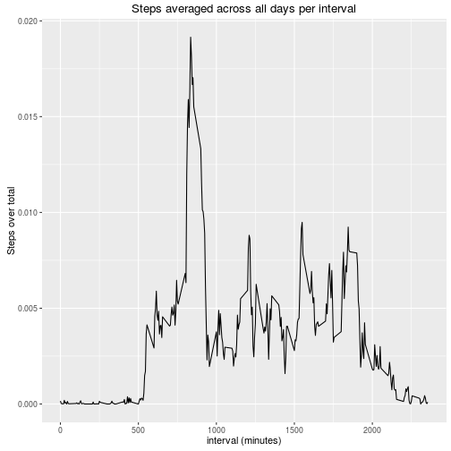

This is my answer to the assignment project 1 of the Reproducible Research course.

1.What is mean total number of steps taken per day?

1.1.Calculating the total number of steps taken per day: 


```r
library(dplyr)
library(ggplot2)
library(reshape)

#downloading, unziping, and reading the file
download.file("https://d396qusza40orc.cloudfront.net/repdata%2Fdata%2Factivity.zip", destfile = "activity.zip", method = "curl")
unzip("activity.zip")
activity <- read.csv("activity.csv")

#creating a table "results" containing the mean, median, and sum values per day 
days <- group_by(activity, date)
results <- summarise(days,mean=mean(steps,na.rm=TRUE), median=median(steps,na.rm=TRUE), sum=sum(steps,na.rm=TRUE))
```

1.2.Making a histogram of the total number of steps taken each day:


```r
hist(results$sum,breaks=10,xlab="Steps in a day", ylab="Amount of days", main="Total Steps per Day")
```


1.3.Reporting the mean and median of the total number of steps taken per day: 


```r
results.Na <- results[!is.na(results$median),]
knitr::kable(results.Na[, 1:3],digits=2,caption="Mean and Median Values of Steps per Day")
```


|date       |  mean| median|
|:----------|-----:|------:|
|2012-10-02 |  0.44|      0|
|2012-10-03 | 39.42|      0|
|2012-10-04 | 42.07|      0|
|2012-10-05 | 46.16|      0|
|2012-10-06 | 53.54|      0|
|2012-10-07 | 38.25|      0|
|2012-10-09 | 44.48|      0|
|2012-10-10 | 34.38|      0|
|2012-10-11 | 35.78|      0|
|2012-10-12 | 60.35|      0|
|2012-10-13 | 43.15|      0|
|2012-10-14 | 52.42|      0|
|2012-10-15 | 35.20|      0|
|2012-10-16 | 52.38|      0|
|2012-10-17 | 46.71|      0|
|2012-10-18 | 34.92|      0|
|2012-10-19 | 41.07|      0|
|2012-10-20 | 36.09|      0|
|2012-10-21 | 30.63|      0|
|2012-10-22 | 46.74|      0|
|2012-10-23 | 30.97|      0|
|2012-10-24 | 29.01|      0|
|2012-10-25 |  8.65|      0|
|2012-10-26 | 23.53|      0|
|2012-10-27 | 35.14|      0|
|2012-10-28 | 39.78|      0|
|2012-10-29 | 17.42|      0|
|2012-10-30 | 34.09|      0|
|2012-10-31 | 53.52|      0|
|2012-11-02 | 36.81|      0|
|2012-11-03 | 36.70|      0|
|2012-11-05 | 36.25|      0|
|2012-11-06 | 28.94|      0|
|2012-11-07 | 44.73|      0|
|2012-11-08 | 11.18|      0|
|2012-11-11 | 43.78|      0|
|2012-11-12 | 37.38|      0|
|2012-11-13 | 25.47|      0|
|2012-11-15 |  0.14|      0|
|2012-11-16 | 18.89|      0|
|2012-11-17 | 49.79|      0|
|2012-11-18 | 52.47|      0|
|2012-11-19 | 30.70|      0|
|2012-11-20 | 15.53|      0|
|2012-11-21 | 44.40|      0|
|2012-11-22 | 70.93|      0|
|2012-11-23 | 73.59|      0|
|2012-11-24 | 50.27|      0|
|2012-11-25 | 41.09|      0|
|2012-11-26 | 38.76|      0|
|2012-11-27 | 47.38|      0|
|2012-11-28 | 35.36|      0|
|2012-11-29 | 24.47|      0|

2.What is the average daily activity pattern?

2.1.Making a time series plot of the 5-minutes interval and the average number of steps taken, averaged across all days:


```r
#creating a table "results" containing the average of steps per interval 
days <- group_by(activity, interval)
results <- summarise(days, average=sum(steps,na.rm=TRUE)/sum(activity$steps,na.rm=TRUE))

#plotting the time series of average calculated above
qplot(results$interval,results$average,geom="line",xlab="interval (minutes)", ylab="Steps over total", main="Steps averaged across all days per interval")
```



2.2.Calculating the 5-minutes interval, on average across all the days in the dataset, that contains the maximum number of steps:


```r
results[results$average==max(results$average),1]
```

```
## Source: local data frame [1 x 1]
## 
##   interval
##      (int)
## 1      835
```

3.Imputing missing values

3.1.Calculating and reporting the total number of missing values in the dataset:


```r
sum(is.na(activity$steps))
```

```
## [1] 2304
```

3.2.Devising a strategy for filling in all of the missing values in the dataset.
 The strategy applied was to substitutite missing values by the mean for that 5-minute interval.
 
3.3.Filling in the table "activity", the missing values of steps, using the mean for that 5-minute interval: 


```r
#Calculating the mean value for each 5-minute interval
intervals <- group_by(activity, interval)
mean.interval <- summarise(intervals, mean=mean(steps,na.rm=TRUE))

#Substituting the missing values in a new dataset "activity.new" by the mean values calculated before.
activity.merged <- merge(activity,mean.interval,by.x="interval",by.y="interval",sort=FALSE)
activity.merged <- arrange(activity.merged,date,interval)
activity.new <- activity
activity.new[is.na(activity.new$steps),1] <- activity.merged[is.na(activity.new$steps),4]
```

3.4. Making the histogram of the total number of steps taken each day, calculating and reporting the mean and median total number of steps taken per day:


```r
#creating a table "results" containing the mean, median, and sum values per day 
days <- group_by(activity.new, date)
results <- summarise(days,mean=mean(steps,na.rm=TRUE), median=median(steps,na.rm=TRUE), sum=sum(steps,na.rm=TRUE))

#Making a histogram of the total number of steps taken each day
hist(results$sum,breaks=10,xlab="Steps in a day", ylab="Amount of days", main="Total Steps per Day")
```


```r
#Reporting the mean and median of the total number of steps taken per day: 
results.Na <- results[!is.na(results$median),]
knitr::kable(results.Na[, 1:3],digits=2,caption="Mean and Median Values of Steps per Day")
```


|date       |  mean| median|
|:----------|-----:|------:|
|2012-10-01 | 37.38|  34.11|
|2012-10-02 |  0.44|   0.00|
|2012-10-03 | 39.42|   0.00|
|2012-10-04 | 42.07|   0.00|
|2012-10-05 | 46.16|   0.00|
|2012-10-06 | 53.54|   0.00|
|2012-10-07 | 38.25|   0.00|
|2012-10-08 | 37.38|  34.11|
|2012-10-09 | 44.48|   0.00|
|2012-10-10 | 34.38|   0.00|
|2012-10-11 | 35.78|   0.00|
|2012-10-12 | 60.35|   0.00|
|2012-10-13 | 43.15|   0.00|
|2012-10-14 | 52.42|   0.00|
|2012-10-15 | 35.20|   0.00|
|2012-10-16 | 52.38|   0.00|
|2012-10-17 | 46.71|   0.00|
|2012-10-18 | 34.92|   0.00|
|2012-10-19 | 41.07|   0.00|
|2012-10-20 | 36.09|   0.00|
|2012-10-21 | 30.63|   0.00|
|2012-10-22 | 46.74|   0.00|
|2012-10-23 | 30.97|   0.00|
|2012-10-24 | 29.01|   0.00|
|2012-10-25 |  8.65|   0.00|
|2012-10-26 | 23.53|   0.00|
|2012-10-27 | 35.14|   0.00|
|2012-10-28 | 39.78|   0.00|
|2012-10-29 | 17.42|   0.00|
|2012-10-30 | 34.09|   0.00|
|2012-10-31 | 53.52|   0.00|
|2012-11-01 | 37.38|  34.11|
|2012-11-02 | 36.81|   0.00|
|2012-11-03 | 36.70|   0.00|
|2012-11-04 | 37.38|  34.11|
|2012-11-05 | 36.25|   0.00|
|2012-11-06 | 28.94|   0.00|
|2012-11-07 | 44.73|   0.00|
|2012-11-08 | 11.18|   0.00|
|2012-11-09 | 37.38|  34.11|
|2012-11-10 | 37.38|  34.11|
|2012-11-11 | 43.78|   0.00|
|2012-11-12 | 37.38|   0.00|
|2012-11-13 | 25.47|   0.00|
|2012-11-14 | 37.38|  34.11|
|2012-11-15 |  0.14|   0.00|
|2012-11-16 | 18.89|   0.00|
|2012-11-17 | 49.79|   0.00|
|2012-11-18 | 52.47|   0.00|
|2012-11-19 | 30.70|   0.00|
|2012-11-20 | 15.53|   0.00|
|2012-11-21 | 44.40|   0.00|
|2012-11-22 | 70.93|   0.00|
|2012-11-23 | 73.59|   0.00|
|2012-11-24 | 50.27|   0.00|
|2012-11-25 | 41.09|   0.00|
|2012-11-26 | 38.76|   0.00|
|2012-11-27 | 47.38|   0.00|
|2012-11-28 | 35.36|   0.00|
|2012-11-29 | 24.47|   0.00|
|2012-11-30 | 37.38|  34.11|

The results show that the number of steps were completely missed in 8 days: October, 1st and 8th, and November, 1st, 4th, 9th, 10th, 14th, and 30th. For these days, the values of mean and median calculated were 37.38 and 34.11, respectively. For the other days, which there were not missing values, nothing changed. By observing the two histograms, one can see that fill in the missing values for these eigth days increased the number of days between 10,000 and 12,500 steps, from 15, in the first histogram, to 23 in the second.

4.Are there differences in activity patterns between weekdays and weekends?

4.1.Creating a new variable in the dataset, "activity.week", with two leves - "weekday" and "weekend":


```r
activity.new$date <-as.Date(as.character(activity.new$date),"%Y-%m-%d")
wdays <- weekdays(activity.new$date)
weekend <- (wdays=="domingo" | wdays=="sábado") 
wdays[weekend] <- "weekend"
wdays[!weekend] <- "weekday"
activity.week <- cbind(activity.new, wdays)
```

4.2.Ploting time series of the 5-minute interval and average number of steps taken, averaged across all weekdays or weekend days:


```r
#Constructing the table "results" with the averaged values of steps taken.
intervals <- group_by(activity.week, interval)
results <- summarise(intervals,weekday=sum(steps,na.rm=TRUE)/sum(activity.week[activity.week$wdays=="weekday",1],na.rm=TRUE),weekend=sum(steps,na.rm=TRUE)/sum(activity.week[activity.week$wdays=="weekend",1],na.rm=TRUE))

#Preparing and ploting the data
results <- as.data.frame(results)
results.melt <- melt(results, id = "interval")
qplot(interval,value,data=results.melt,xlab='Interval (minutes)',ylab='Steps Averaged', main='Steps Averaged Across Weekdays and Weekend', geom="line")+facet_grid(variable~.)
```


